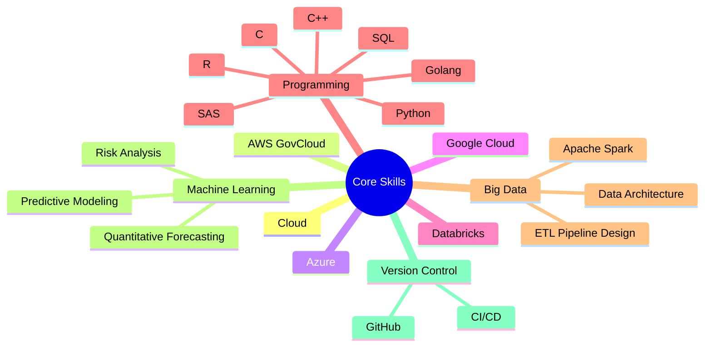

# 👋 Matthew Kolakowski

## About Me

I am a Senior Data Professional specializing in transforming complex challenges into measurable operational improvements. With experience spanning government agencies and Fortune 500 enterprises, I bridge the gap between data science and business strategy to deliver impactful solutions.

### 🎯 What I Do

- 📊 Design and implement large-scale data architectures.
- 🤖 Develop machine learning models for real-world applications.
- 📈 Drive data-driven decision-making across organizations.
- 👥 Lead high-performing technical teams.
- 🌐 Deliver enterprise-wide data strategies.

## 🎓 Education

- 🔭 MEng Computer Engineering (Expected 2025) - Dartmouth College
- 📊 MS Analytics (2022) - Duke University
- 🎓 PhD Business Administration (2017) - Oklahoma State University

## 💼 Professional Journey

Currently leading data science initiatives, where I:
- Spearheaded ML/AI projects resulting in $1.2M cost savings.
- Direct multi-national data strategy implementations.
- Lead rapid-delivery data science teams across AWS-GovCloud infrastructure.

Previously transformed data landscapes at:
- 🏦 Wells Fargo (Risk Modeling & Quantitative Forecasting).
- 🏥 Defense Health Agency (COVID-19 Modeling & Enterprise Data Management).
- 🎓 Valdosta State University (Research & Economic Development).

## 🛠️ Tech Stack

## 🌟 Highlights

- 📈 Led 35+ completed data science projects in 8 months.
- 🏆 Developed models managing billions of monthly transactions.
- 🌐 Directed 50+ FTEs across international data science initiatives.
- 📚 Published researcher with proven economic impact.
- 💡 Track record of innovation in healthcare data analytics.
---
