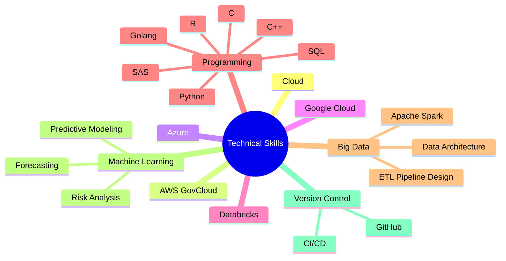

# Matthew Kolakowski

## About Me

I am a Lead Robotics Engineer specializing in transforming complex challenges into measurable operational improvements. 

## Education

- MEng Computer and Electrical Engineering (2025) - Dartmouth College
- MS Analytics (2022) - Duke University
- PhD Business Administration (2017) - Oklahoma State University

## Professional Journey

Previously at:
- Wells Fargo (Risk Modeling & Quantitative Forecasting).
- Defense Health Agency (COVID-19 Modeling & Enterprise Data Management).
- Valdosta State University (Management & Quantitative Methods Research).

## Tech Stack

```mermaid
mindmap
  root((Technical Skills))
      Cloud
      AWS GovCloud
      Azure
      Google Cloud
      Databricks
    Programming
      Python
      C
      Golang
      C++
      R
      SQL
      SAS
    Big Data
      Apache Spark
      Data Architecture
      ETL Pipeline Design
    Machine Learning
      Predictive Modeling
      Risk Analysis
      Forecasting
    Version Control
      GitHub
      CI/CD
```

## Highlights

- Led 35+ completed data science projects in 8 months.
- Developed models managing billions of monthly transactions.
- Directed 50+ FTEs across international data science initiatives.
- Published researcher with proven economic impact.
- Track record of innovation in healthcare data analytics.
---
